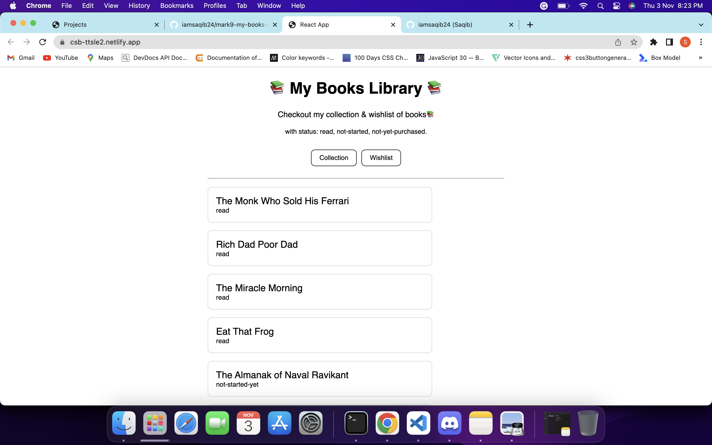
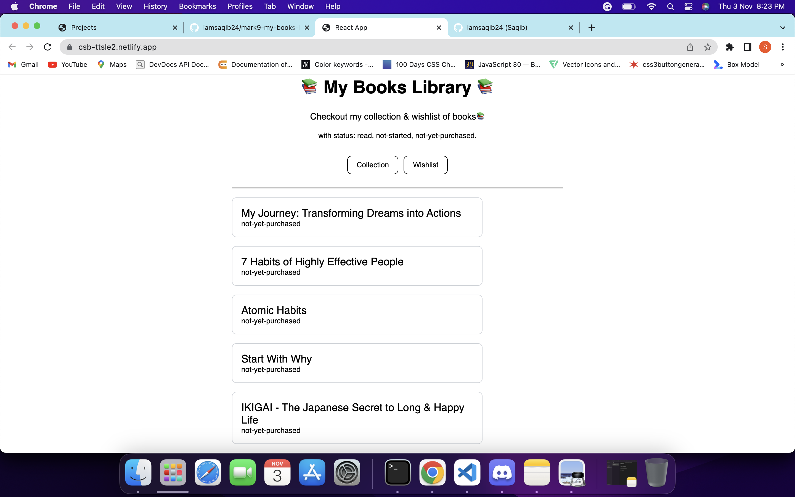

# Mark9-My-Books-Library

This is basic react app which i built on CodeSandBox. Basically, in this app you will find two section. One is my books collection, where you will find all the books which i have in and it also show you the status that i have read or not. And the second is it has option as wishlist, which shows you the books which i kept in my wishlist to buy in future.

## Technologies i used to build this:

1. HTML
2. CSS
3. ReactJS

---

## Project is live, to check [click here](https://csb-ttsle2.netlify.app/ "My Books Library")

## Image

---

